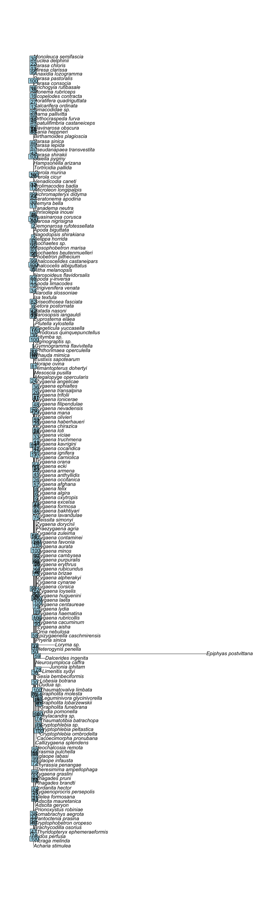
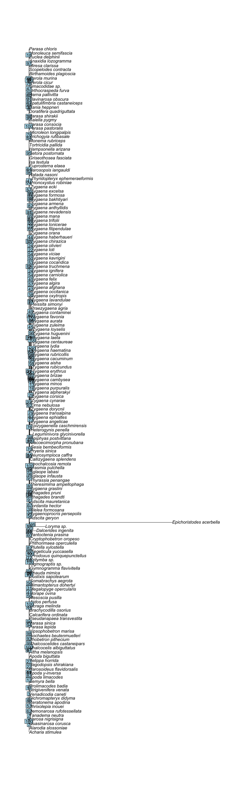
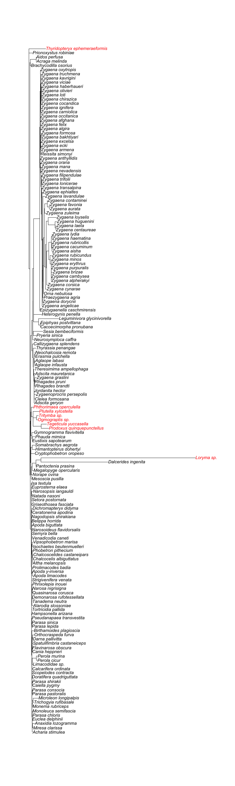
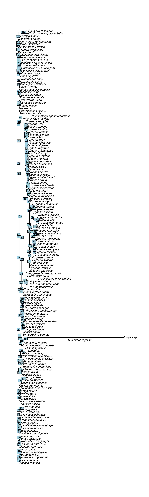
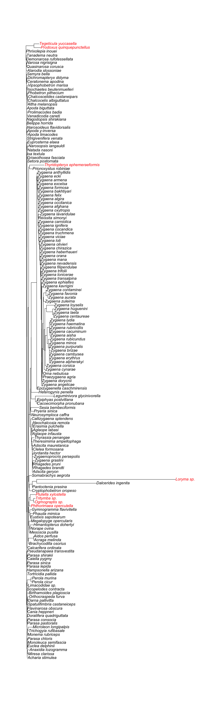
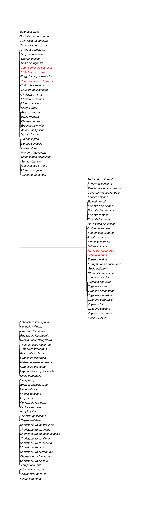
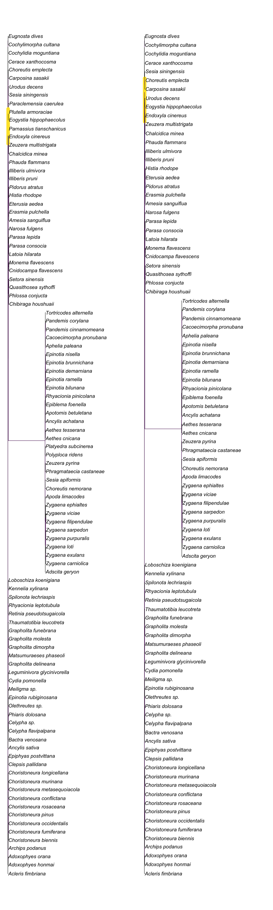
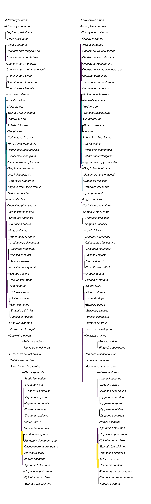

<!DOCTYPE html>
<html xmlns="http://www.w3.org/1999/xhtml" lang="en" xml:lang="en"><head>

<meta charset="utf-8">
<meta name="generator" content="quarto-1.5.57">

<meta name="viewport" content="width=device-width, initial-scale=1.0, user-scalable=yes">

<title>final_project</title>

<link href="final_project_files/libs/quarto-html/tippy.css" rel="stylesheet">
<link href="final_project_files/libs/quarto-html/quarto-syntax-highlighting.css" rel="stylesheet" id="quarto-text-highlighting-styles">

<link href="final_project_files/libs/bootstrap/bootstrap-icons.css" rel="stylesheet">
<link href="final_project_files/libs/bootstrap/bootstrap.min.css" rel="stylesheet" id="quarto-bootstrap" data-mode="light">

</head>

<body class="fullcontent">

<main class="content" id="quarto-document-content">

<section id="robustness-of-phylogenetic-tree-inference---apoditrysia" class="level1">
<h1>Robustness of Phylogenetic Tree Inference - Apoditrysia</h1>
</section>
<section id="introduction-and-goals" class="level1">
<h1>Introduction and Goals</h1>

This project aims to examine the sensitivity of the phylogenetic trees inferred from Apoditrysia (butterflies and larger moths) sequences. Two datasets were created. The first dataset consisted of 18S sequences from Apoditrysia, which are highly conserved and therefore useful for phylogenetic analyses. The second dataset contained full mitochondrial genomes. Both datasets were extracted from BLAST using a bait sequence and aligned using MAFFT.

Dataset 1: 
To begin, 166 sequences were found in Apoditrysia. The outgroup taxa were chosen such that 6/8 occured in Ditrysia clade but not the Apoditrysia clade. Then the remaining two outgroup taxa were from Incurvarioidea (yucca and fairy moths), which is in Heteroneura along with Ditrysia. The goal of such outgroup sampling was to find outgroups that have varying degrees of similarity to the target clade.

In summary 
Outgroup: 6/8 in Ditrysia. 
Gelechioidea: Phthorimaea_operculella 
Obtectomera: Loryma_sp. 
Tineoidea: Ogmograptis_sp., Thyridopteryx_ephemeraeformis 
Yponomeutoidea: Tritymba_sp., Plutella_xylostella 

2/8 in sister taxa to Incurvarioidea 
Prodoxus_quinquepunctellus, Tegeticula_yuccasella

Dataset 2: 
96 species from Apoditrysia 
5 outgroup species: Polyploca_ridens, Platyedra_subcinerea, Parnassius_tianschanicus, Plutella_armoraciae, Paraclemensia_caerulea from groups with various distances from Apoditrysia. 

The sequences were then combined, and regex was used to adjust the labels of the FASTA files.

The particular regex used was Find: &gt;\S* (\S<em>)\s(\S</em>).* Replace: &gt;$1_$2

Then the sequences were aligned using MAFFT and analyses were performed using the McCleary Cluster.

</section>
<section id="methods" class="level1">
<h1>Methods</h1>

IQTree and RevBayes were used to generate trees. The R package TreeDist was used to quantify and visualize the difference between trees.

All input fasta files, .sh files, .rev files, and output files are included in this directory.

</section>
<section id="results" class="level1">
<h1>Results</h1>

IQTree was first used to generate the most likely tree using bootstrapping (1000 iterations) on all extracted 18S sequences.

<pre class="sourceCode r code-with-copy"><code class="sourceCode r">first_pass = read.tree("all_18s_aligned.fa.treefile")</code><button title="Copy to Clipboard" class="code-copy-button"><i class="bi"></i></button></pre>

<pre class="sourceCode r code-with-copy"><code class="sourceCode r">plot(first_pass)
nodelabels(first_pass$node.label)</code><button title="Copy to Clipboard" class="code-copy-button"><i class="bi"></i></button></pre>

<figure class="figure">

</figure>

It may not be very obvious, but the bootstrap support of this tree is not great. Below is a histogram of the supports.

<pre class="sourceCode r code-with-copy"><code class="sourceCode r">hist(as.integer(first_pass$node.label), xlab="Bootstrap support", main="")</code><button title="Copy to Clipboard" class="code-copy-button"><i class="bi"></i></button></pre>

<figure class="figure">

</figure>

Therefore, the dataset was pruned by removing sequences that were much longer (i.e.&nbsp;3-4k nucleotides longer than the majority). This was about 10 sequences and helped the alignment to have less gaps.

(Previously, most alignmemts had ~60% gaps on average).

<pre class="sourceCode r code-with-copy"><code class="sourceCode r">pruned = read.tree("18s_pruned_aligned.fasta.treefile")
plot(pruned)
nodelabels(pruned$node.label)</code><button title="Copy to Clipboard" class="code-copy-button"><i class="bi"></i></button></pre>

<figure class="figure">

</figure>

And a histogram of the bootstrap supports for this tree:

<pre class="sourceCode r code-with-copy"><code class="sourceCode r">hist(as.integer(pruned$node.label), xlab="Bootstrap support", main="")</code><button title="Copy to Clipboard" class="code-copy-button"><i class="bi"></i></button></pre>

<figure class="figure">

</figure>

As one can see, while the support it is still not ideal, the histogram appears to be much better.

Now, to do another sanity check, one can observe the location of the outgroup taxa (in red).

<pre class="sourceCode r code-with-copy"><code class="sourceCode r">colors = ifelse(grepl("Phthorimaea_operculella|Loryma_sp.|Ogmograptis_sp.|Thyridopteryx_ephemeraeformis|Tritymba_sp.|Plutella_xylostella|Prodoxus_quinquepunctellus|Tegeticula_yuccasella",pruned$tip.label),"red","black")

plot(pruned,tip.color=colors)</code><button title="Copy to Clipboard" class="code-copy-button"><i class="bi"></i></button></pre>

<figure class="figure">

</figure>

Most of the outgroup taxa are near each other as desired. However, they are in the middle of the phylogeny for some reason (perhaps this is because MAFFT adjusted the order). However, while this “looks” weird, it is not actually significant to the topology of the tree, so I will reorder for future analysis.

More concerning is that <em>Thyridopteryx</em> is clearly far removed from the remainder of its outgroup brethren. Further inverstigation reveals that it is not in Tineoidea as BLAST promised; therefore, a more closely related species to Apoditrysia might be chosen instead.

Finally, an analysis of the sequences reveals that <em>Epichoristodes_acerbella</em> has a very sparce alignment. Thus, I will remove it as it is uninformative in its current state. This can be seen in the produced tree in which Epichoristodes stands out from the rest of the taxa.

Below is the updated tree with <em>Epichoristodes_acerbella</em> removed. The bootstrap support is better but still not ideal, and the outgroups are generally together.

<pre class="sourceCode r code-with-copy"><code class="sourceCode r">pruned2 = read.tree("v2_18s_pruned_aligned.fasta.treefile")
plot(pruned2)
nodelabels(pruned2$node.label)</code><button title="Copy to Clipboard" class="code-copy-button"><i class="bi"></i></button></pre>

<figure class="figure">

</figure>

<pre class="sourceCode r code-with-copy"><code class="sourceCode r">hist(as.integer(pruned2$node.label), xlab="Bootstrap support", main="")</code><button title="Copy to Clipboard" class="code-copy-button"><i class="bi"></i></button></pre>

<figure class="figure">

</figure>

<pre class="sourceCode r code-with-copy"><code class="sourceCode r">colors = ifelse(grepl("Phthorimaea_operculella|Loryma_sp.|Ogmograptis_sp.|Thyridopteryx_ephemeraeformis|Tritymba_sp.|Plutella_xylostella|Prodoxus_quinquepunctellus|Tegeticula_yuccasella",pruned2$tip.label),"red","black")

plot(pruned2,tip.color=colors)</code><button title="Copy to Clipboard" class="code-copy-button"><i class="bi"></i></button></pre>

<figure class="figure">

</figure>

Additionally, IQTree has an outgroup function that should (theoretically) group all the outgroups together. However, the tree generated using this method not only has lower bootstrap support values but also does not group the outgroup “clade” together. Therefore, the previous model is condsidered preferable.

<pre class="sourceCode r code-with-copy"><code class="sourceCode r">t = read.tree("outgroup_auto.fasta.treefile")
plot(t)
nodelabels(t$node.label)</code><button title="Copy to Clipboard" class="code-copy-button"><i class="bi"></i></button></pre>

<figure class="figure">

</figure>

<pre class="sourceCode r code-with-copy"><code class="sourceCode r">hist(as.integer(t$node.label), xlab="Bootstrap support", main="")</code><button title="Copy to Clipboard" class="code-copy-button"><i class="bi"></i></button></pre>

<figure class="figure">

</figure>

<pre class="sourceCode r code-with-copy"><code class="sourceCode r">colors = ifelse(grepl("Phthorimaea_operculella|Loryma_sp.|Ogmograptis_sp.|Thyridopteryx_ephemeraeformis|Tritymba_sp.|Plutella_xylostella|Prodoxus_quinquepunctellus|Tegeticula_yuccasella",t$tip.label),"red","black")

plot(t,tip.color=colors)</code><button title="Copy to Clipboard" class="code-copy-button"><i class="bi"></i></button></pre>

<figure class="figure">

</figure>

Next, the preferred ML tree was compared to a Bayesian tree created using RevBayes (HKY).

<pre class="sourceCode r code-with-copy"><code class="sourceCode r">t = read.nexus("bayes_HKY.nex")</code><button title="Copy to Clipboard" class="code-copy-button"><i class="bi"></i></button></pre>

<figure class="figure">

<figcaption>HKY 18S</figcaption>
</figure>

Note that the posterior probability of each branch is very low – most of them are below 0.2.

Therefore, it remained clear that more data was needed in order to create a more robust tree. Espeland et al.&nbsp;(2018) created a phylogeny of butterflies (closely related to Apoditrysia) and provided a list of probes. Python was used to randomly sample 15% of the probes. The sampled probes were then used in nBLAST. It was observed that the CO1 gene (Cytochrome c oxidase I) was well-sampled within <em>Apoditrysia</em>; moreover, a number of species had complete mitochondria gene sequences that contained CO1. Therefore, a complete mitochondria sequence was used as a probe in nBLAST.

The resulting IQtree model had much better results: the bootstrap supports were higher. However, the outgroups were not next to each other; this could be a result of choosing outgroups too close to the ingroup (in fact, NCBI does not consider those in Obtectomera to be within Apoditrysia but Wikipedia does.)

<pre class="sourceCode r code-with-copy"><code class="sourceCode r">mito = read.tree("mito1_al.fasta.treefile")
plot(mito)
nodelabels(mito$node.label)</code><button title="Copy to Clipboard" class="code-copy-button"><i class="bi"></i></button></pre>

<figure class="figure">

</figure>

<pre class="sourceCode r code-with-copy"><code class="sourceCode r">hist(as.integer(mito$node.label), xlab="Bootstrap support", main="")</code><button title="Copy to Clipboard" class="code-copy-button"><i class="bi"></i></button></pre>

<figure class="figure">

</figure>

<pre class="sourceCode r code-with-copy"><code class="sourceCode r">colors = ifelse(grepl("Polyploca_ridens|Platyedra_subcinerea|Parnassius_tianschanicus|Plutella_armoraciae|Paraclemensia_caerulea",mito$tip.label),"red","black")

plot(mito,tip.color=colors)</code><button title="Copy to Clipboard" class="code-copy-button"><i class="bi"></i></button></pre>

<figure class="figure">

</figure>

Thus another IQTree run was completed to see if the outgroups had any impact on the tree at all. Below is the no-outgroup tree which apppears very similar to the above standard auto tree for the mitochondria data.

<pre class="sourceCode r code-with-copy"><code class="sourceCode r">x_out = read.tree("mito1_nooutgroup.fasta.treefile")
plot(x_out)</code><button title="Copy to Clipboard" class="code-copy-button"><i class="bi"></i></button></pre>

<figure class="figure">

</figure>

The TreeDist package was then used to quantify the differences between these 2 trees. In particular, the TreeDistance function shows the clustering information variation between the mitochondial trees with and without outgroups normalized by the total information content of all splits.

<pre class="sourceCode r code-with-copy"><code class="sourceCode r">out_diff = TreeDistance(mito, x_out)
print(out_diff)</code><button title="Copy to Clipboard" class="code-copy-button"><i class="bi"></i></button></pre>

<pre><code>[1] 0.03208044</code></pre>

which indicates that the trees are very similar.

Visually, the difference between the trees was as follows:

<pre class="sourceCode r code-with-copy"><code class="sourceCode r">VisualizeMatching(MatchingSplitDistance, mito, x_out, edge.cex=FALSE)</code><button title="Copy to Clipboard" class="code-copy-button"><i class="bi"></i></button></pre>

<pre><code>Warning in edge.width[se] &lt;- 1 + (10 * ns): number of items to replace is not a
multiple of replacement length</code></pre>

<pre><code>Warning in edge.color[se] &lt;- edgeColPalette[1 + ceiling(255 * ns)]: number of
items to replace is not a multiple of replacement length</code></pre>

<figure class="figure">

</figure>

In the above example, the yellow colored splits indicate a difference between both trees. This only occurs due to the removal of the outgroups, implying that the outgroups have little to no impact on the tree itself.

So how sensitive is the is the base ML tree to ablation? 25 species were removed at random from the tree, and two ways of re-aligning the data were completed. The first was a “clipping” of previous alignments; that is, the alignment of the 75 remaining species did not change, and less sequences were used to construct the tree. The second is an actual re-alignment of all kept species.

Here is the clipped version:

<pre class="sourceCode r code-with-copy"><code class="sourceCode r">clipped = read.tree("mito_abl_clipped.fasta.treefile")
plot(clipped)
nodelabels(clipped$node.label)</code><button title="Copy to Clipboard" class="code-copy-button"><i class="bi"></i></button></pre>

<figure class="figure">

</figure>

<pre class="sourceCode r code-with-copy"><code class="sourceCode r">hist(as.integer(clipped$node.label), xlab="Bootstrap support", main="")</code><button title="Copy to Clipboard" class="code-copy-button"><i class="bi"></i></button></pre>

<figure class="figure">

</figure>

And here is the realigned version:

<pre class="sourceCode r code-with-copy"><code class="sourceCode r">realigned = read.tree("mito_abl.fasta.treefile")
plot(realigned)
nodelabels(realigned$node.label)</code><button title="Copy to Clipboard" class="code-copy-button"><i class="bi"></i></button></pre>

<figure class="figure">

</figure>

<pre class="sourceCode r code-with-copy"><code class="sourceCode r">hist(as.integer(realigned$node.label), xlab="Bootstrap support", main="")</code><button title="Copy to Clipboard" class="code-copy-button"><i class="bi"></i></button></pre>

<figure class="figure">

</figure>

Now we can compare the trees.

<pre class="sourceCode r code-with-copy"><code class="sourceCode r">tocomp_trees = structure(list(base = mito, clipped = clipped , realigned = realigned), class = 'multiPhylo')

print(TreeDistance(tocomp_trees, tocomp_trees))</code><button title="Copy to Clipboard" class="code-copy-button"><i class="bi"></i></button></pre>

<pre><code>                base    clipped realigned
base      0.00000000 0.08843369 0.2960598
clipped   0.06401343 0.00000000 0.2378496
realigned 0.27654539 0.23715756 0.0000000</code></pre>

Clearly, the realigned version has more differences to the base and clipped trees than the base tree has to the clipped tree. This indicates that IQTree is very sensitive to the alignment of the data.

We can also visually compare the clipped and realigned trees using the same distance metric as the previous example (that is, recording the split differences of the two trees)

<pre class="sourceCode r code-with-copy"><code class="sourceCode r">VisualizeMatching(MatchingSplitDistance, clipped, realigned, edge.cex=FALSE)</code><button title="Copy to Clipboard" class="code-copy-button"><i class="bi"></i></button></pre>

<figure class="figure">

</figure>

While there are similarities between the two trees, there are also some differences especially pertaining to the upper part of the tree.

It is also interesting to compare the IQTrees to those created using RevBayes. First, two trees were created using the ‘base’ dataset according to the HKY and GTR models.

HKY:

<pre class="sourceCode r code-with-copy"><code class="sourceCode r">rb_hky = read.nexus("rb_mito1_al_HKY.tre")</code><button title="Copy to Clipboard" class="code-copy-button"><i class="bi"></i></button></pre>

<figure class="figure">

<figcaption>HKY Base Model</figcaption>
</figure>

Note that similar to the IQTree trees, this HKY model shows vast improvements to the posterior probabilities compared to the 18S data.

GTR:

<pre class="sourceCode r code-with-copy"><code class="sourceCode r">rb_gtr = read.nexus("rb_mito1_al_GTR.tre")

# removing single quotes
for (i in 1:length(rb_gtr$tip.label)) {
  s &lt;- rb_gtr$tip.label[i]
  if (substring(s, 1, 1) == "'") {
    rb_gtr$tip.label[i] &lt;- substring(s, 2, nchar(s) - 1)
  }
}</code><button title="Copy to Clipboard" class="code-copy-button"><i class="bi"></i></button></pre>

<figure class="figure">

<figcaption>GTR Base BI Model</figcaption>
</figure>

Comparing these Bayesian-generated base trees to the ML-generated IQTrees from before:

<pre class="sourceCode r code-with-copy"><code class="sourceCode r">tocomp_trees = structure(list(ML_Base = mito, RB_HKY = rb_hky , RB_GTR = rb_gtr), class = 'multiPhylo')

print(TreeDistance(tocomp_trees, tocomp_trees))</code><button title="Copy to Clipboard" class="code-copy-button"><i class="bi"></i></button></pre>

<pre><code>          ML_Base     RB_HKY     RB_GTR
ML_Base 0.0000000 0.18513679 0.18767012
RB_HKY  0.1851368 0.00000000 0.09500635
RB_GTR  0.1876701 0.09500635 0.00000000</code></pre>

Note that the metric we are using here (Information-based generalized Robinson–Foulds distances) is not symmetric; the distance from ML_Base to RB_HKY is not equal to the distance from RB_HKY to ML_Base. Clearly, RF distance is symmetric, so the cause of this asymmetry is probably a difference in the information content of some splits in the trees.

However, the general pattern remains clear. The RevBayes trees are closer to each other than to the IQTree. This suggests that this particular dataset could be slightly sensitive to the phylogenetic tree-generating method.

Next, the two RevBayes base trees were visually compared to analyze where their differences occur. It is clear that most species are in similar places in both trees (for example, <em>Pidorus</em> moved within the <em>Pidorus</em>, <em>Histia</em>, <em>Eterusia</em>, <em>Erasmia</em>, <em>Amesia</em> clade).

<pre class="sourceCode r code-with-copy"><code class="sourceCode r">VisualizeMatching(MatchingSplitDistance, rb_hky, rb_gtr, edge.cex=FALSE)</code><button title="Copy to Clipboard" class="code-copy-button"><i class="bi"></i></button></pre>

<figure class="figure">

</figure>

Note that <em>Grapholita</em> is not monophyletic in the HKY tree but is monophyletic in the GTR tree. Given that the latter is probably more likely, further ablation and no-outgroup trees were built using RevBayes GTR.

Below is the no outgroup Bayesian Infererance GTR tree.

<pre class="sourceCode r code-with-copy"><code class="sourceCode r">rb_xog = read.nexus("rb_mito1_nooutgroup_GTR.tre")</code><button title="Copy to Clipboard" class="code-copy-button"><i class="bi"></i></button></pre>

<figure class="figure">

<figcaption>GTR No Outgroup BI Model</figcaption>
</figure>

Notably, removing the outgroup lowers the posterior probabilities of many splits. However, the resulting trees are very similar (a distance of ~0.08 as seen below).

<pre class="sourceCode r code-with-copy"><code class="sourceCode r">print(TreeDistance(rb_gtr, rb_xog))</code><button title="Copy to Clipboard" class="code-copy-button"><i class="bi"></i></button></pre>

<pre><code>[1] 0.08107694</code></pre>

Then the two ablation trees (clipped and realignment) were built.

<pre class="sourceCode r code-with-copy"><code class="sourceCode r">rb_clip = read.nexus("rb_mito_abl_clipped_GTR.tre")</code><button title="Copy to Clipboard" class="code-copy-button"><i class="bi"></i></button></pre>

<figure class="figure">

<figcaption>GTR Clipped Ablation BI Model</figcaption>
</figure>

<pre class="sourceCode r code-with-copy"><code class="sourceCode r">rb_realign = read.nexus("rb_mito_abl_GTR.tre")</code><button title="Copy to Clipboard" class="code-copy-button"><i class="bi"></i></button></pre>

<figure class="figure">

<figcaption>GTR Realigned Ablation BI Model</figcaption>
</figure>

Clearly, both have slightly reduced posterior probablilities compared to the base BI model.

<pre class="sourceCode r code-with-copy"><code class="sourceCode r">tocomp_trees = structure(list(BI_Base = rb_gtr, Clipped = rb_clip , Realigned = rb_realign), class = 'multiPhylo')

print(TreeDistance(tocomp_trees, tocomp_trees))</code><button title="Copy to Clipboard" class="code-copy-button"><i class="bi"></i></button></pre>

<pre><code>            BI_Base    Clipped  Realigned
BI_Base   0.0000000 0.08856116 0.13683887
Clipped   0.1014466 0.00000000 0.07444176
Realigned 0.1377383 0.06214738 0.00000000</code></pre>

However, the clipped and realigned models are very close to one another (and both are closer to BI base GTR than either the ML clipped or ML realigned were to the base ML model). This suggests that perhaps Bayesian inference is a better fit for this data set as the model is more robust.

Finally, the clipped and realigned models are visualized to contextualize their differences.

<pre class="sourceCode r code-with-copy"><code class="sourceCode r">VisualizeMatching(MatchingSplitDistance, rb_clip, rb_realign, edge.cex=FALSE)</code><button title="Copy to Clipboard" class="code-copy-button"><i class="bi"></i></button></pre>

<figure class="figure">

</figure>

Again, one observes that the trees are very similar with small clade rearrangements.

</section>
<section id="discussion" class="level1">
<h1>Discussion</h1>

In summary, the quality (and quantity) of the data used in any phylogenetic inference model is vital to the overall robustness of the model. More than one gene is therefore preferable to build a strong model. This was shown via the difference in quality between the 18S and mitochondria base ML trees. Further mitochondria dataset analyses showed that the Bayesian GTR tree was more robust than the ML tree to ablation, removal of outgroups, and realignment of data subsets. The largest challenge was data processing. In particular, curating a dataset that would have better bootstrap support and posterior probabilities compared to the 18S dataset proved to be a challenge. Future directions could include testing a different clade, more and/or different genes, and other phylogenetic tree inferance software such as RAxML.

</section>
<section id="references" class="level1">
<h1>References</h1>

Espeland M, Breinholt J, Willmott KR, Warren AD, Vila R, Toussaint EFA, Maunsell SC, Aduse-Poku K, Talavera G, Eastwood R, Jarzyna MA, Guralnick R, Lohman DJ, Pierce NE, Kawahara AY. A Comprehensive and Dated Phylogenomic Analysis of Butterflies. <em>Curr Biol.</em> 2018 Mar 5;28(5):770-778.e5. doi: 10.1016/j.cub.2018.01.061. Epub 2018 Feb 15. PMID: 29456146.

</section>

</main>
<!-- /main column -->

 <!-- /content -->

</body></html>