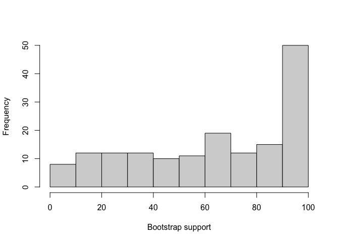

# Robustness of Phylogenetic Tree Inference - Apoditrysia

# Introduction and Goals

This project aims to examine the sensitivity of the phylogenetic trees
inferred from Apoditrysia (butterflies and larger moths) sequences. Two
datasets were created. The first dataset consisted of 18S sequences from
Apoditrysia, which are highly conserved and therefore useful for
phylogenetic analyses. The second dataset contained full mitochondrial
genomes. Both datasets were extracted from BLAST using a bait sequence
and aligned using MAFFT.

Dataset 1:  
To begin, 166 sequences were found in Apoditrysia. The outgroup taxa
were chosen such that 6/8 occured in Ditrysia clade but not the
Apoditrysia clade. Then the remaining two outgroup taxa were from
Incurvarioidea (yucca and fairy moths), which is in Heteroneura along
with Ditrysia. The goal of such outgroup sampling was to find outgroups
that have varying degrees of similarity to the target clade.

In summary  
Outgroup: 6/8 in Ditrysia.  
Gelechioidea: Phthorimaea_operculella  
Obtectomera: Loryma_sp.  
Tineoidea: Ogmograptis_sp., Thyridopteryx_ephemeraeformis  
Yponomeutoidea: Tritymba_sp., Plutella_xylostella  

2/8 in sister taxa to Incurvarioidea  
Prodoxus_quinquepunctellus, Tegeticula_yuccasella

Dataset 2:  
96 species from Apoditrysia  
5 outgroup species: Polyploca_ridens, Platyedra_subcinerea,
Parnassius_tianschanicus, Plutella_armoraciae, Paraclemensia_caerulea
from groups with various distances from Apoditrysia.  

The sequences were then combined, and regex was used to adjust the
labels of the FASTA files.

The particular regex used was Find: \>\S\* (\S*)\s(\S*).\* Replace:
\>$1\_$2

Then the sequences were aligned using MAFFT and analyses were performed
using the McCleary Cluster.

# Methods

IQTree and RevBayes were used to generate trees. The R package TreeDist
was used to quantify and visualize the difference between trees.

All input fasta files, .sh files, .rev files, and output files are
included in this directory.

# Results

IQTree was first used to generate the most likely tree using
bootstrapping (1000 iterations) on all extracted 18S sequences.

``` r
first_pass = read.tree("all_18s_aligned.fa.treefile")
```

``` r
plot(first_pass)
nodelabels(first_pass$node.label)
```


It may not be very obvious, but the bootstrap support of this tree is
not great. Below is a histogram of the supports.

``` r
hist(as.integer(first_pass$node.label), xlab="Bootstrap support", main="")
```


Therefore, the dataset was pruned by removing sequences that were much
longer (i.e. 3-4k nucleotides longer than the majority). This was about
10 sequences and helped the alignment to have less gaps.

(Previously, most alignments had ~60% gaps).

``` r
pruned = read.tree("18s_pruned_aligned.fasta.treefile")
plot(pruned)
nodelabels(pruned$node.label)
```


And a histogram of the bootstrap supports for this new tree:

``` r
hist(as.integer(pruned$node.label), xlab="Bootstrap support", main="")
```



As one can see, while the support is still not ideal, the histogram
appears to be much better.

Now, to do another sanity check, one can observe the location of the
outgroup taxa (in red).

``` r
colors = ifelse(grepl("Phthorimaea_operculella|Loryma_sp.|Ogmograptis_sp.|Thyridopteryx_ephemeraeformis|Tritymba_sp.|Plutella_xylostella|Prodoxus_quinquepunctellus|Tegeticula_yuccasella",pruned$tip.label),"red","black")

plot(pruned,tip.color=colors)
```


Most of the outgroup taxa are near each other as desired. However, they
are in the middle of the phylogeny for some reason (perhaps this is
because MAFFT adjusted the order). However, while this “looks” weird, it
is not actually significant to the topology of the tree, so I will
reorder for future analyses.

More concerning is that *Thyridopteryx* is clearly far removed from the
remainder of its outgroup brethren. Further inverstigation reveals that
it is not in Tineoidea as BLAST promised; therefore, a different
outgroup species might be a better choice.

Finally, an analysis of the sequences reveals that
*Epichoristodes_acerbella* has a very sparse alignment. Thus, I will
remove it as it is uninformative in its current state. This can be seen
in the produced tree in which Epichoristodes stands out from the rest of
the taxa.

Below is the updated tree with *Epichoristodes_acerbella* removed. The
bootstrap support is better but still not ideal, and the outgroups are
generally together.

``` r
pruned2 = read.tree("v2_18s_pruned_aligned.fasta.treefile")
plot(pruned2)
nodelabels(pruned2$node.label)
```


``` r
hist(as.integer(pruned2$node.label), xlab="Bootstrap support", main="")
```


``` r
colors = ifelse(grepl("Phthorimaea_operculella|Loryma_sp.|Ogmograptis_sp.|Thyridopteryx_ephemeraeformis|Tritymba_sp.|Plutella_xylostella|Prodoxus_quinquepunctellus|Tegeticula_yuccasella",pruned2$tip.label),"red","black")

plot(pruned2,tip.color=colors)
```


Additionally, IQTree has an outgroup function that should
(theoretically) group all the outgroups together. However, the tree
generated using this method not only has lower bootstrap support values
but also does not group the outgroup “clade” together. Therefore, the
previous model is condsidered preferable.

``` r
t = read.tree("outgroup_auto.fasta.treefile")
plot(t)
nodelabels(t$node.label)
```


``` r
hist(as.integer(t$node.label), xlab="Bootstrap support", main="")
```


``` r
colors = ifelse(grepl("Phthorimaea_operculella|Loryma_sp.|Ogmograptis_sp.|Thyridopteryx_ephemeraeformis|Tritymba_sp.|Plutella_xylostella|Prodoxus_quinquepunctellus|Tegeticula_yuccasella",t$tip.label),"red","black")

plot(t,tip.color=colors)
```


Next, the preferred ML tree was compared to a Bayesian tree created
using RevBayes (HKY).

``` r
t = read.nexus("bayes_HKY.nex")
```

<figure id="id">

<figcaption aria-hidden="true">HKY 18S</figcaption>
</figure>

Note that the posterior probability of each branch is very low – most
posteriors are below 0.2.

Therefore, it remained clear that more data was needed in order to
create a more robust tree. Espeland et al. (2018) created a phylogeny of
butterflies (closely related to Apoditrysia) and provided a list of
probes. Python was used to randomly sample 15% of the probes. The
sampled probes were then used in nBLAST. It was observed that the CO1
gene (Cytochrome c oxidase I) was well-sampled within *Apoditrysia*;
moreover, a number of species had complete mitochondria gene sequences
that contained CO1. Therefore, a complete mitochondria sequence was used
as a probe in nBLAST.

The resulting IQtree model had much better results: the bootstrap
supports were higher. However, the outgroups were not next to each
other; this could be a result of choosing outgroups too close to the
ingroup (in fact, NCBI does not consider those in Obtectomera to be
within Apoditrysia but Wikipedia does.)

``` r
mito = read.tree("mito1_al.fasta.treefile")
plot(mito)
nodelabels(mito$node.label)
```


``` r
hist(as.integer(mito$node.label), xlab="Bootstrap support", main="")
```


``` r
colors = ifelse(grepl("Polyploca_ridens|Platyedra_subcinerea|Parnassius_tianschanicus|Plutella_armoraciae|Paraclemensia_caerulea",mito$tip.label),"red","black")

plot(mito,tip.color=colors)
```


Thus another IQTree run was completed to see if the outgroups had any
impact on the tree at all. Below is the no-outgroup tree which apppears
very similar to the above standard auto tree for the mitochondria data.

``` r
x_out = read.tree("mito1_nooutgroup.fasta.treefile")
plot(x_out)
```


The TreeDist package was then used to quantify the differences between
these 2 trees. In particular, the TreeDistance function shows the
clustering information variation between the mitochondial trees with and
without outgroups normalized by the total information content of all
splits.

``` r
out_diff = TreeDistance(mito, x_out)
print(out_diff)
```

    [1] 0.03208044

which indicates that the trees are very similar.

Visually, the difference between the trees was as follows:

``` r
VisualizeMatching(MatchingSplitDistance, mito, x_out, edge.cex=FALSE)
```

    Warning in edge.width[se] <- 1 + (10 * ns): number of items to replace is not a
    multiple of replacement length

    Warning in edge.color[se] <- edgeColPalette[1 + ceiling(255 * ns)]: number of
    items to replace is not a multiple of replacement length


In the above example, the yellow colored splits indicate a difference
between both trees. This only occurs due to the removal of the
outgroups, implying that the outgroups have little to no impact on the
tree itself.

So how sensitive is the is the base ML tree to ablation? 25 species were
removed at random from the tree, and two ways of re-aligning the data
were completed. The first was a “clipping” of previous alignments; that
is, the alignment of the 76 remaining species did not change, and less
sequences were used to construct the tree. The second is an actual
re-alignment of all kept species.

Here is the clipped version:

``` r
clipped = read.tree("mito_abl_clipped.fasta.treefile")
plot(clipped)
nodelabels(clipped$node.label)
```


``` r
hist(as.integer(clipped$node.label), xlab="Bootstrap support", main="")
```


And here is the realigned version:

``` r
realigned = read.tree("mito_abl.fasta.treefile")
plot(realigned)
nodelabels(realigned$node.label)
```


``` r
hist(as.integer(realigned$node.label), xlab="Bootstrap support", main="")
```


Now we can compare the trees.

``` r
tocomp_trees = structure(list(base = mito, clipped = clipped , realigned = realigned), class = 'multiPhylo')

print(TreeDistance(tocomp_trees, tocomp_trees))
```

                    base    clipped realigned
    base      0.00000000 0.08843369 0.2960598
    clipped   0.06401343 0.00000000 0.2378496
    realigned 0.27654539 0.23715756 0.0000000

Clearly, the realigned version has more differences to the base and
clipped trees than the base tree has to the clipped tree. This indicates
that IQTree is sensitive to the alignment of this dataset.

We can also visually compare the clipped and realigned trees using the
same distance metric as the previous example (that is, recording the
split differences of the two trees)

``` r
VisualizeMatching(MatchingSplitDistance, clipped, realigned, edge.cex=FALSE)
```


While there are similarities between the two trees, there are also some
differences especially pertaining to the upper part of the tree.

It is also interesting to compare the IQTrees to those created using
RevBayes. First, two trees were created using the ‘base’ dataset
according to the HKY and GTR models.

HKY:

``` r
rb_hky = read.nexus("rb_mito1_al_HKY.tre")
```

<figure id="id">

<figcaption aria-hidden="true">HKY Base Model</figcaption>
</figure>

Note that similar to the IQTree trees, this HKY model shows vast
improvements to the posterior probabilities compared to the 18S data.

GTR:

``` r
rb_gtr = read.nexus("rb_mito1_al_GTR.tre")

# removing single quotes
for (i in 1:length(rb_gtr$tip.label)) {
  s <- rb_gtr$tip.label[i]
  if (substring(s, 1, 1) == "'") {
    rb_gtr$tip.label[i] <- substring(s, 2, nchar(s) - 1)
  }
}
```

<figure id="id">

<figcaption aria-hidden="true">GTR Base BI Model</figcaption>
</figure>

Comparing these Bayesian-generated base trees to the ML-generated
IQTrees from before:

``` r
tocomp_trees = structure(list(ML_Base = mito, RB_HKY = rb_hky , RB_GTR = rb_gtr), class = 'multiPhylo')

print(TreeDistance(tocomp_trees, tocomp_trees))
```

              ML_Base     RB_HKY     RB_GTR
    ML_Base 0.0000000 0.18513679 0.18767012
    RB_HKY  0.1851368 0.00000000 0.09500635
    RB_GTR  0.1876701 0.09500635 0.00000000

Note that the metric we are using here (Information-based generalized
Robinson–Foulds distances) is not symmetric; the distance from ML_Base
to RB_HKY is not equal to the distance from RB_HKY to ML_Base. Clearly,
RF distance is symmetric, so the cause of this asymmetry is probably a
difference in the information content of some splits in the trees.

However, the general pattern remains clear. The RevBayes trees are
closer to each other than to the IQTree. This suggests that this
particular dataset could be slightly sensitive to the phylogenetic
tree-generating method.

Next, the two RevBayes base trees were visually compared to analyze
where their differences occur. It is clear that most species are in
similar places in both trees (for example, *Pidorus* moved within the
*Pidorus*, *Histia*, *Eterusia*, *Erasmia*, *Amesia* clade).

``` r
VisualizeMatching(MatchingSplitDistance, rb_hky, rb_gtr, edge.cex=FALSE)
```


Note that *Grapholita* is not monophyletic in the HKY tree but is
monophyletic in the GTR tree. Given that the latter is probably more
likely, further ablation and no-outgroup trees were built using RevBayes
GTR.

Below is the no outgroup Bayesian Infererance GTR tree.

``` r
rb_xog = read.nexus("rb_mito1_nooutgroup_GTR.tre")
```

<figure id="id">

<figcaption aria-hidden="true">GTR No Outgroup BI Model</figcaption>
</figure>

Notably, removing the outgroup lowers the posterior probabilities of
many splits. However, the resulting trees are very similar (a distance
of ~0.08 as seen below).

``` r
print(TreeDistance(rb_gtr, rb_xog))
```

    [1] 0.08107694

Then the two ablation trees (clipped and realignment) were built.

``` r
rb_clip = read.nexus("rb_mito_abl_clipped_GTR.tre")
```

<figure id="id">

<figcaption aria-hidden="true">GTR Clipped Ablation BI
Model</figcaption>
</figure>

``` r
rb_realign = read.nexus("rb_mito_abl_GTR.tre")
```

<figure id="id">

<figcaption aria-hidden="true">GTR Realigned Ablation BI
Model</figcaption>
</figure>

Clearly, both have slightly reduced posterior probablities compared to
the base BI model.

``` r
tocomp_trees = structure(list(BI_Base = rb_gtr, Clipped = rb_clip , Realigned = rb_realign), class = 'multiPhylo')

print(TreeDistance(tocomp_trees, tocomp_trees))
```

                BI_Base    Clipped  Realigned
    BI_Base   0.0000000 0.08856116 0.13683887
    Clipped   0.1014466 0.00000000 0.07444176
    Realigned 0.1377383 0.06214738 0.00000000

However, the clipped and realigned models are very close to one another
(and both are closer to BI base GTR than either the ML clipped or ML
realigned were to the base ML model). This suggests that perhaps
Bayesian inference is a better fit for this data set as the model is
more robust.

Finally, the clipped and realigned models are visualized to
contextualize their differences.

``` r
VisualizeMatching(MatchingSplitDistance, rb_clip, rb_realign, edge.cex=FALSE)
```


Again, one observes that the trees are very similar with small clade
rearrangements.

# Discussion

In summary, the quality (and quantity) of the data used in any
phylogenetic inference model is vital to the overall robustness of the
model. More than one gene is therefore preferable to build a strong
model. This was shown via the difference in quality between the 18S and
mitochondria base ML trees. Further mitochondria dataset analyses showed
that the Bayesian GTR tree was more robust than the ML tree to ablation,
and realignment of data subsets. The largest challenge was data
processing. In particular, curating a dataset that would have better
bootstrap support and posterior probabilities compared to the 18S
dataset proved to be a challenge. Future directions could include
testing a different clade, more and/or different genes, and other
phylogenetic tree inferance software such as RAxML.

# References

Espeland M, Breinholt J, Willmott KR, Warren AD, Vila R, Toussaint EFA,
Maunsell SC, Aduse-Poku K, Talavera G, Eastwood R, Jarzyna MA, Guralnick
R, Lohman DJ, Pierce NE, Kawahara AY. A Comprehensive and Dated
Phylogenomic Analysis of Butterflies. *Curr Biol.* 2018 Mar
5;28(5):770-778.e5. doi: 10.1016/j.cub.2018.01.061. Epub 2018 Feb 15.
PMID: 29456146.
